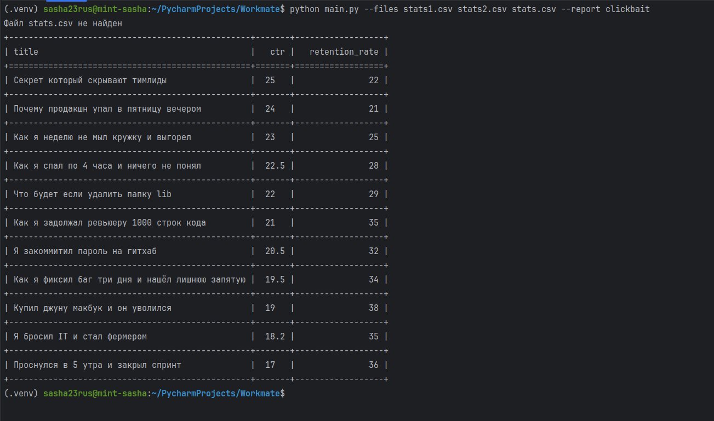
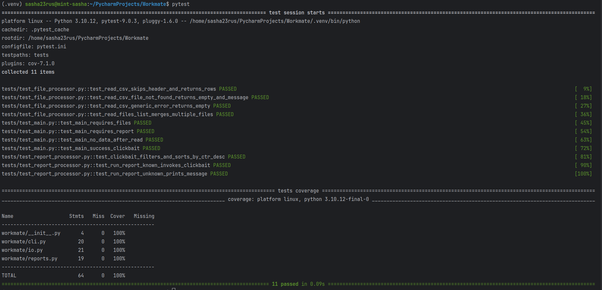

# Workmate

Утилита для отчётов по CSV с метриками роликов. 
Несколько файлов склеиваются в один список строк; отчёты выбираются по имени.

Oтчёт **clickbait**: строки, где CTR выше 15% и удержание ниже 40%, сортируются по CTR по убыванию и выводятся таблицей.

**Примеры:**

```bash
python main.py --files stats1.csv --report clickbait
python main.py --files stats1.csv stats2.csv --report clickbait
pytest
```

**Для ревью:**

 Новые отчёты добавляются методами в `ReportProcessor`(workmate/reports.py) и регистрируются в словаре `reports` — точка расширения без правки общего цикла. 

При пустых `--files` / `--report` или нечитаемых файлах скрипт пишет сообщение в stdout и выходит; при отсутствии данных после чтения — отдельная ошибка.

Зависимость: `pytest`, `pytest-cov`, `tabulate`. Проверялось на Python 3.10

Примеры работ 

main_py.png 

pytest.png
